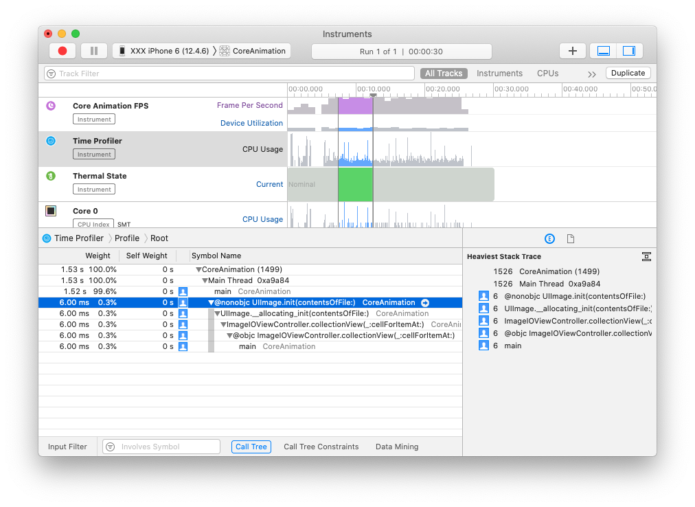

> 这是 Core Animation 的系列文章，介绍了 Core Animation 的用法，以及如何进行性能优化。
>
> 1. [CoreAnimation基本介绍](https://github.com/pro648/tips/blob/master/sources/CoreAnimation%E5%9F%BA%E6%9C%AC%E4%BB%8B%E7%BB%8D.md)
> 2. [CGAffineTransform和CATransform3D](https://github.com/pro648/tips/blob/master/sources/CGAffineTransform%E5%92%8CCATransform3D.md)
> 3. [CALayer及其各种子类](https://github.com/pro648/tips/blob/master/sources/CALayer%E5%8F%8A%E5%85%B6%E5%90%84%E7%A7%8D%E5%AD%90%E7%B1%BB.md)
> 4. [CAAnimation：属性动画CABasicAnimation、CAKeyframeAnimation以及过渡动画、动画组](https://github.com/pro648/tips/blob/master/sources/CAAnimation%EF%BC%9A%E5%B1%9E%E6%80%A7%E5%8A%A8%E7%94%BBCABasicAnimation%E3%80%81CAKeyframeAnimation%E4%BB%A5%E5%8F%8A%E8%BF%87%E6%B8%A1%E5%8A%A8%E7%94%BB%E3%80%81%E5%8A%A8%E7%94%BB%E7%BB%84.md)
> 5. [图层时间CAMediaTiming](https://github.com/pro648/tips/blob/master/sources/%E5%9B%BE%E5%B1%82%E6%97%B6%E9%97%B4CAMediaTiming.md)
> 6. [计时器CADisplayLink](https://github.com/pro648/tips/blob/master/sources/%E8%AE%A1%E6%97%B6%E5%99%A8CADisplayLink.md)
> 7. [影响动画性能的因素及如何使用 Instruments 检测](https://github.com/pro648/tips/blob/master/sources/%E5%BD%B1%E5%93%8D%E5%8A%A8%E7%94%BB%E6%80%A7%E8%83%BD%E7%9A%84%E5%9B%A0%E7%B4%A0%E5%8F%8A%E5%A6%82%E4%BD%95%E4%BD%BF%E7%94%A8%20Instruments%20%E6%A3%80%E6%B5%8B.md)
> 8. [图像IO之图片加载、解码，缓存](https://github.com/pro648/tips/blob/master/sources/%E5%9B%BE%E5%83%8FIO%E4%B9%8B%E5%9B%BE%E7%89%87%E5%8A%A0%E8%BD%BD%E3%80%81%E8%A7%A3%E7%A0%81%EF%BC%8C%E7%BC%93%E5%AD%98.md)
> 9. [图层性能之离屏渲染、栅格化、回收池](https://github.com/pro648/tips/blob/master/sources/%E5%9B%BE%E5%B1%82%E6%80%A7%E8%83%BD%E4%B9%8B%E7%A6%BB%E5%B1%8F%E6%B8%B2%E6%9F%93%E3%80%81%E6%A0%85%E6%A0%BC%E5%8C%96%E3%80%81%E5%9B%9E%E6%94%B6%E6%B1%A0.md)

[上一篇](https://github.com/pro648/tips/blob/master/sources/%E5%BD%B1%E5%93%8D%E5%8A%A8%E7%94%BB%E6%80%A7%E8%83%BD%E7%9A%84%E5%9B%A0%E7%B4%A0%E5%8F%8A%E5%A6%82%E4%BD%95%E4%BD%BF%E7%94%A8%20Instruments%20%E6%A3%80%E6%B5%8B.md)文章介绍了 Core Animation 如何进行渲染，可能的性能瓶颈点，以及如何使用 Instruments 检测修复。这一篇文章介绍如何优化加载、渲染磁盘、网络中的图片。

## 1. 加载和延迟

图片绘制通常不是最影响性能的部分。图片很消耗内存，因此不太可能把所有需要显示的图片都保留在内存中，app 运行时需不断加载、释放图片。

图片加载速度不仅受 CPU 制约，还受 *IO（Input/Output）*影响。磁盘读取速度比 RAM 慢很多，需谨慎管理加载，减少延迟。点击按钮到收到响应之间最大延迟约200ms，超过这个时长会有卡顿的感觉。

有时不能把所有图片加载到内存中。比如，轮播的图片，图片可能有很多张，都加载到内存中太占用内存。更多时候图片来自网络，下载会很耗时，甚至失败。

#### 1.1 加载线程

[上一篇](https://github.com/pro648/tips/blob/master/sources/%E5%BD%B1%E5%93%8D%E5%8A%A8%E7%94%BB%E6%80%A7%E8%83%BD%E7%9A%84%E5%9B%A0%E7%B4%A0%E5%8F%8A%E5%A6%82%E4%BD%95%E4%BD%BF%E7%94%A8%20Instruments%20%E6%A3%80%E6%B5%8B.md)文章的图片很小，直接在主线程进行了加载。如果直接在主线程加载大图，会导致主界面失去响应。滑动动画在主线程的`UITrackingRunLoopMode`执行，比在 render tree 执行的`CAAnimation`更容易出现卡顿。

下面代码使用[UICollectionView]()实现了图片播放，在`collectionView(_:cellForItemAt:)`方法中使用主线程同步加载图片。如下所示：

```
class ImageIOViewController: BaseViewController {
    
    let flowLayout: UICollectionViewFlowLayout = {
        let flowLayout = UICollectionViewFlowLayout()
        flowLayout.scrollDirection = .horizontal
        flowLayout.itemSize = UIScreen.main.bounds.size
        return flowLayout
    }()
    var collectionView: UICollectionView?
    
    private let cellIdentifier = "cellIdentifier"
    var imagePaths = [String]()

    override func viewDidLoad() {
        super.viewDidLoad()

        imagePaths = Bundle.main.paths(forResourcesOfType: "png", inDirectory: "Vacation Photos")
        
        collectionView = UICollectionView(frame: .zero, collectionViewLayout: flowLayout)
        collectionView?.register(UICollectionViewCell.self, forCellWithReuseIdentifier: cellIdentifier)
        collectionView?.dataSource = self
        view.addSubview(collectionView!)
        
        collectionView?.translatesAutoresizingMaskIntoConstraints = false
        collectionView?.topAnchor.constraint(equalTo: view.topAnchor).isActive = true
        collectionView?.leadingAnchor.constraint(equalTo: view.leadingAnchor).isActive = true
        collectionView?.bottomAnchor.constraint(equalTo: view.bottomAnchor).isActive = true
        collectionView?.trailingAnchor.constraint(equalTo: view.trailingAnchor).isActive = true
    }
}

extension ImageIOViewController: UICollectionViewDataSource {
    func numberOfSections(in collectionView: UICollectionView) -> Int {
        return 1
    }
    
    func collectionView(_ collectionView: UICollectionView, numberOfItemsInSection section: Int) -> Int {
        return imagePaths.count
    }
    
    func collectionView(_ collectionView: UICollectionView, cellForItemAt indexPath: IndexPath) -> UICollectionViewCell {
        let cell = collectionView.dequeueReusableCell(withReuseIdentifier: cellIdentifier, for: indexPath)
        
        // Add image view
        let imageTag = 99
        var imageView = cell.viewWithTag(imageTag) as? UIImageView
        if imageView == nil {
            imageView = UIImageView(frame: cell.contentView.bounds)
            imageView!.tag = imageTag
            cell.contentView.addSubview(imageView!)
        }
        
        // Set image
        let imagePath = imagePaths[indexPath.item]
        imageView?.image = UIImage(contentsOfFile: imagePath)
        
        return cell
    }
}
```

运行后如下：


使用 Instruments 分析可以发现瓶颈在于`collectionView(_:cellForItemAt:)`中的`UIImage(contentsOfFile: )`方法，如下所示：



把加载图片任务转移到其他线程，这样主线程就可以处理交互任务，滑动时就不会出现卡顿。

> 使用后台线程加载图片虽然可以解决卡顿问题，但图片加载时长并没有减少，甚至可能因为后台线程优先级低图片加载时长变长，但可以充分发挥设备多核优势。点击[多线程简述](https://github.com/pro648/tips/blob/master/sources/%E5%A4%9A%E7%BA%BF%E7%A8%8B%E7%AE%80%E8%BF%B0.md)了解更多。

可以使用 [GCD](https://github.com/pro648/tips/blob/master/sources/Grand%20Central%20Dispatch%E7%9A%84%E4%BD%BF%E7%94%A8.md)、[OperationQueue](https://github.com/pro648/tips/blob/master/sources/Operation%E3%80%81OperationQueue%E7%9A%84%E4%BD%BF%E7%94%A8.md)等多线程方案后台加载图片，也可以使用`CATiledLayer`异步加载图片。如果是网络图片，可以使用[URLSession](https://github.com/pro648/tips/blob/master/sources/URLSession%E8%AF%A6%E8%A7%A3.md)异步加载。

#### 1.2 GCD

在`collectionView(_:cellForItemAt:)`方法中使用GCD的后台线程加载图片，图片加载完成后切换至主线程更新UI。`UICollectionView`会回收复用 cell，图片加载完成时 cell 可能已经被复用。为避免图片显示到错误 cell，显示图片前为视图添加 tag，设置图片前检查 tag 是否存在。更新后如下：

```
    func collectionView(_ collectionView: UICollectionView, cellForItemAt indexPath: IndexPath) -> UICollectionViewCell {
        let cell = collectionView.dequeueReusableCell(withReuseIdentifier: cellIdentifier, for: indexPath)
        
        // Add image view
        let imageTag = 99
        var imageView = cell.viewWithTag(imageTag) as? UIImageView
        if imageView == nil {
            imageView = UIImageView(frame: cell.contentView.bounds)
            imageView!.tag = imageTag
            cell.contentView.addSubview(imageView!)
        }
        
        // Tag cell with index and clear current image
        cell.tag = indexPath.row
        imageView?.image = nil
        
        // Switch to background thread
        DispatchQueue.global(qos: .utility).async {
            // Load image
            let idx = indexPath.item
            let imagePath = self.imagePaths[idx]
            let img = UIImage(contentsOfFile: imagePath)
            
            // Set image on main thread, but only if index still matches up
            DispatchQueue.main.async {
                if idx == cell.tag {
                    imageView?.image = img
                }
            }
        }
        
        return cell
    }
```

再次使用 Instruments 分析，已经看不到`UIImage(contentsOfFile:)`方法了。性能有了一定程度提升，但仍有掉帧。

#### 1.3 延迟解码

图片加载后还需解码，解码过程可能需要复杂计算，会耗费一定时间。解码后的图片也会占用更多内存资源。

加载和解码所需 CPU 时间因图片格式而异。png 文件大，加载时间长，但解码速度快，Xcode 会对项目内 png 图片进行压缩优化。JPEG 文件小，加载快，但因编码算法复杂，解码速度慢。

为了减少内存占用，系统会延迟解码，直到需要绘制时才解码，但这样也容易引起性能问题。

有以下三种立即解码的方案：

- 使用`UIImage(named:)`方法加载图片。与`UIImage(contentsOfFile:)`不同，`UIImage(named:)`加载后立即解码。`UIImage(named:)`加载图片有以下特点：
  - `UIImage(named:)`只加载 bundle 内图片，不适用于用户生成的、网络获取的图片。
  - `UIImage(named:)`方法会自动缓存图片，后续使用时直接从内存读区。系统的按钮、背景等都是使用`UIImage(named:)`方法加载的图片。如果使用`UIImage(named:)`加载大图，系统可能移除界面控件图片缓存，当导航回这些界面时，需重新加载这些图片。使用单独缓存可以解耦图片缓存与 app 生命周期。
  - `UIImage(named:)`缓存是私有的，不能查询图片是否在缓存中，也不能从缓存中移除不再使用的图片。
- 为图层的`contents`属性设置图片，或为`UIImageview`的`image`属性赋值，但这些操作都必须在主线程进行，也就是不能用来解决性能问题。
- 绕过`UIKit`框架，直接使用`ImageIO`框架。
- 使用`UIKit`框架加载图片，加载后立即在`CGContext`中绘制。

使用`ImageIO`解码方案如下：

```
            // Load image
            let idx = indexPath.item
            let imageUrl = URL(fileURLWithPath: self.imagePaths[idx])
            
            let options = [kCGImageSourceShouldCache : true]
            let source = CGImageSourceCreateWithURL(imageUrl as CFURL, nil)
            var img = UIImage()
            if source != nil {
                let imageRef = CGImageSourceCreateImageAtIndex(source!, 0, options as CFDictionary)
                if imageRef != nil {
                    img = UIImage(cgImage: imageRef!)
                }
            }
```

`kCGImageSourceShouldCache`选项会缓存解码的图片，直到图片被销毁。

图片绘制前必须解码，绘制可以像加载一样在后台线程进行，避免堵塞主线程。为了实现立即解码，有以下两种方案：

- 在一像素的`CGContext`中绘制一像素的图片。这样绘制速度极快，也会对整个图片进行解码。缺点在于绘制不能针对设备优化，后续绘制时耗时可能较长。系统为了优化内存可能释放掉已解码的图片。
- 把整张图片绘制到`CGContext`，使用 context 的 content 替换原始图片。这会比绘制一像素耗费性能，但绘制会针对设备进行优化。由于原始图片已经被舍弃，系统无法决定是否释放掉内存中解码的图片。

系统并不推荐使用这些技巧立即解码图片，但如果你的 app 有大量图片，你可能用得到这些技巧。

如果图片显示大小与自身大小不一致，使用后台线程绘制为显示大小更有利于性能，而非每次显示时进行缩放。更新`collectionView(_:cellForItemAt:)`方法，显示图片前进行重绘，更新后如下：

```
func collectionView(_ collectionView: UICollectionView, cellForItemAt indexPath: IndexPath) -> UICollectionViewCell {
        ...
        
        // Switch to background thread
        DispatchQueue.global(qos: .utility).async {
            // Load image
            let idx = indexPath.item
            let imagePath = self.imagePaths[idx]
            var img = UIImage(contentsOfFile: imagePath)
            
            // Redraw image using device context
            UIGraphicsBeginImageContextWithOptions(imgSize ?? CGSize.zero, true, 0)
            img?.draw(in: imgBounds ?? CGRect.zero)
            img = UIGraphicsGetImageFromCurrentImageContext()
            UIGraphicsEndImageContext()
            
            // Set image on main thread, but only if index still matches up
            DispatchQueue.main.async {
                if idx == cell.tag {
                    imageView?.image = img
                }
            }
        }
        
        return cell
    }
```

再次滑动 collection view，滑动已经非常流畅。

## 2. NSCache

创建自定义的缓存系统是必要的。创建自定义缓存涉及以下几方面：

- 选择缓存键。缓存键用来标记缓存中的资源。在上述示例中，可以使用图片名称、cell index作为 key。
- 提前缓存。如果加载、生成数据比较慢，可以在使用前提前加载。在上述示例中，可以根据当前滑动位置、方向判断将要显示哪个图片，提前加载。
- 缓存失效。缓存的图片更新后，如何更新缓存中图片？可以在缓存图片时添加时间戳，提取时比较文件修改日期。
- 缓存回收。缓存将要耗尽时，先移除哪些缓存？这需要一套算法，根据使用频率、加载耗费资源等决定。幸运的是 Apple 提供的`NSCache`类已经自动处理了这些问题。

`NSCache`与`NSDictionary`有很多相似之处，可以通过`setObject(_:forKey:)`、`object(forKey:)`方法设置、获取缓存中的资源，但`NSCache`在内存不足时会自动释放缓存中资源。

`NSCache`文档并没有介绍管理缓存的算法，但可以使用`countLimit`设置缓存对象数量上限，使用`totalCostLimit`设置缓存大小限制。

`NSCache`是通用缓存解决方案。虽然我们可以创建自定义类，针对滑动图片进行优化，但`NSCache`已经能够满足当前需求，无需过早优化。

下面代码使用`NSCache`提前加载图片，查看滚动效果是否更好。

```
    func collectionView(_ collectionView: UICollectionView, cellForItemAt indexPath: IndexPath) -> UICollectionViewCell {
        let cell = collectionView.dequeueReusableCell(withReuseIdentifier: cellIdentifier, for: indexPath)
        
        var imageView = cell.contentView.subviews.last as? UIImageView
        if imageView == nil {
            imageView = UIImageView(frame: cell.contentView.bounds)
            imageView?.contentMode = .scaleAspectFit
            cell.contentView.addSubview(imageView!)
        }
        
        // Set or load iamge for this index
        imageView?.image = loadImage(at: indexPath.item)
        
        // Preload image for previous and next index.
        if indexPath.item < self.imagePaths.count - 1 {
            loadImage(at: indexPath.item + 1)
        }
        if indexPath.item > 0 {
            loadImage(at: indexPath.item - 1)
        }
        
        return cell
    }
    
    @discardableResult
    func loadImage(at index: Int) -> UIImage? {
        let image: UIImage? = cache.object(forKey: CustomKey(int: index, string: String(index))) as? UIImage
        
        if image != nil {
            if image!.isKind(of: NSNull.self) {
                return nil
            } else {
                return image
            }
        }
        
        // Set placeholder to avoid reloading image multiple times
        cache.setObject(NSNull.self, forKey: CustomKey(int: index, string: String(index)))
        
        // Switch to background thread
        DispatchQueue.global().async {
            // Load Image
            let imagePath = self.imagePaths[index]
            
            var image = UIImage(contentsOfFile: imagePath)
            
            // Redraw image using device context
            UIGraphicsBeginImageContextWithOptions(image?.size ?? CGSize.zero, true, 0)
            image?.draw(at: CGPoint.zero)
            image = UIGraphicsGetImageFromCurrentImageContext()
            UIGraphicsEndImageContext()
            
            // Set image for correct image view
            DispatchQueue.main.async {
                self.cache.setObject(image ?? NSNull.self, forKey: CustomKey(int: index, string: String(index)))
                
                // Display the image
                let indexPath = NSIndexPath(item: index, section: 0) as IndexPath
                let cell = self.collectionView?.cellForItem(at: indexPath)
                
                let imageView = cell?.contentView.subviews.last as? UIImageView
                imageView?.image = image
            }
        }
        
        return nil
    }
```

再次滑动 collection view，效果非常好。这里提前加载逻辑非常粗暴，其实还可以把滑动方向和速度考虑进来。

## 总结

这篇文章介绍了图片加载、解码可能涉及到的性能问题，并提供了一些解决方案。下一篇文章[图层性能之离屏渲染、栅格化、回收池](https://github.com/pro648/tips/blob/master/sources/%E5%9B%BE%E5%B1%82%E6%80%A7%E8%83%BD%E4%B9%8B%E7%A6%BB%E5%B1%8F%E6%B8%B2%E6%9F%93%E3%80%81%E6%A0%85%E6%A0%BC%E5%8C%96%E3%80%81%E5%9B%9E%E6%94%B6%E6%B1%A0.md)将介绍图层渲染和图层组合相关的性能问题。

> 上一篇：[影响动画性能的因素及如何使用 Instruments 检测](https://github.com/pro648/tips/blob/master/sources/%E5%BD%B1%E5%93%8D%E5%8A%A8%E7%94%BB%E6%80%A7%E8%83%BD%E7%9A%84%E5%9B%A0%E7%B4%A0%E5%8F%8A%E5%A6%82%E4%BD%95%E4%BD%BF%E7%94%A8%20Instruments%20%E6%A3%80%E6%B5%8B.md)
>
> 下一篇：[图层性能之离屏渲染、栅格化、回收池](https://github.com/pro648/tips/blob/master/sources/%E5%9B%BE%E5%B1%82%E6%80%A7%E8%83%BD%E4%B9%8B%E7%A6%BB%E5%B1%8F%E6%B8%B2%E6%9F%93%E3%80%81%E6%A0%85%E6%A0%BC%E5%8C%96%E3%80%81%E5%9B%9E%E6%94%B6%E6%B1%A0.md)

Demo名称：CoreAnimation  
源码地址：<https://github.com/pro648/BasicDemos-iOS/tree/master/CoreAnimation>

