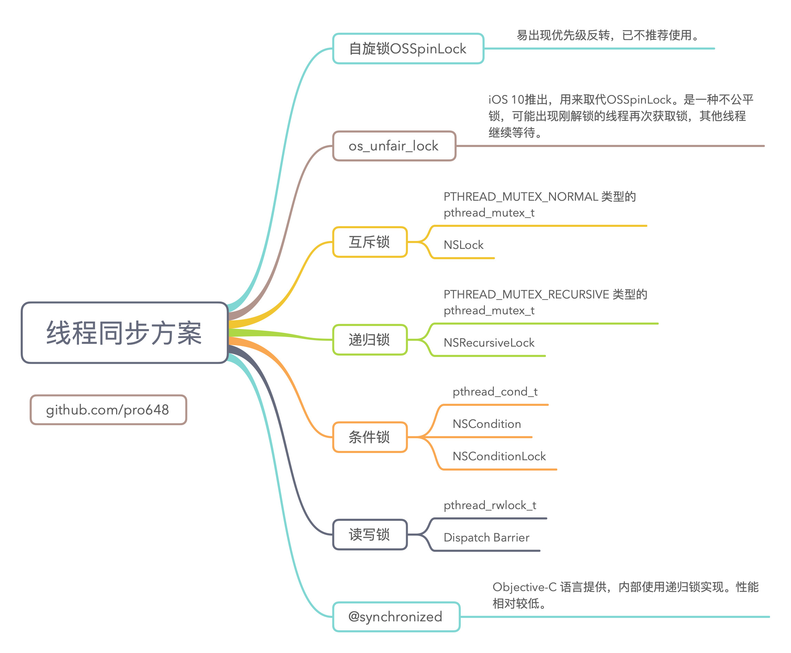

> 这是并发控制方案的系列文章，介绍了各种锁的使用及优缺点。
>
> 1. [自旋锁](https://github.com/pro648/tips/blob/master/sources/%E7%BA%BF%E7%A8%8B%E5%90%8C%E6%AD%A5%E4%B9%8B%E8%87%AA%E6%97%8B%E9%94%81.md)
> 2. [os_unfair_lock](https://github.com/pro648/tips/blob/master/sources/%E7%BA%BF%E7%A8%8B%E5%90%8C%E6%AD%A5%E4%B9%8Bos_unfair_lock.md)
> 3. [互斥锁](https://github.com/pro648/tips/blob/master/sources/%E7%BA%BF%E7%A8%8B%E5%90%8C%E6%AD%A5%E4%B9%8B%E4%BA%92%E6%96%A5%E9%94%81.md)
> 4. [递归锁](https://github.com/pro648/tips/blob/master/sources/%E7%BA%BF%E7%A8%8B%E5%90%8C%E6%AD%A5%E4%B9%8B%E9%80%92%E5%BD%92%E9%94%81.md)
> 5. [条件锁](https://github.com/pro648/tips/blob/master/sources/%E7%BA%BF%E7%A8%8B%E5%90%8C%E6%AD%A5%E4%B9%8B%E6%9D%A1%E4%BB%B6%E9%94%81.md)
> 6. [读写锁](https://github.com/pro648/tips/blob/master/sources/%E7%BA%BF%E7%A8%8B%E5%90%8C%E6%AD%A5%E4%B9%8B%E8%AF%BB%E5%86%99%E9%94%81.md)
> 7. [@synchronized](https://github.com/pro648/tips/blob/master/sources/%E7%BA%BF%E7%A8%8B%E5%90%8C%E6%AD%A5%E4%B9%8B@synchronized.md)
>
> OSSpinLock、os_unfair_lock、pthread_mutex_t、pthread_cond_t、pthread_rwlock_t 是值类型，不是引用类型。这意味着使用 = 会进行复制，使用复制的可能导致闪退。pthread 函数认为其一直处于初始化的内存地址，将其移动到其他内存地址会产生问题。使用copy的OSSpinLock不会崩溃，但会得到一个全新的锁。

> 如果你对线程、进程、串行、并发、并行、锁等概念还不了解，建议先查看以下文章：
>
> - [Grand Central Dispatch的使用](https://github.com/pro648/tips/blob/master/sources/Grand%20Central%20Dispatch%E7%9A%84%E4%BD%BF%E7%94%A8.md)
> - [Operation、OperationQueue的使用](https://github.com/pro648/tips/blob/master/sources/Operation%E3%80%81OperationQueue%E7%9A%84%E4%BD%BF%E7%94%A8.md)
> - [多线程简述](https://github.com/pro648/tips/blob/master/sources/%E5%A4%9A%E7%BA%BF%E7%A8%8B%E7%AE%80%E8%BF%B0.md)
> - [并发控制之线程同步](https://github.com/pro648/tips/blob/master/sources/%E5%B9%B6%E5%8F%91%E6%8E%A7%E5%88%B6%E4%B9%8B%E7%BA%BF%E7%A8%8B%E5%90%8C%E6%AD%A5.md)
> - [并发控制之无锁编程](https://github.com/pro648/tips/blob/master/sources/%E5%B9%B6%E5%8F%91%E6%8E%A7%E5%88%B6%E4%B9%8B%E6%97%A0%E9%94%81%E7%BC%96%E7%A8%8B.md)

互斥锁（mutual exclusion，缩写为 mutex）是一种并发控制方案，用于解决竞争条件（race condition）。

这篇文章包含两种实现互斥锁的方案：`pthread_mutex_t`和`NSLock`。

## 1. pthread_mutex_t

可移植操作系统接口（Portable Operating System Interface，缩写为 POSIX）是 IEEE 为在各种 UNIX 操作系统上运行软件，而定义的一系列互相关联的标准总和，X 表明其对 Unix API 的传承。

POSIX Thread 常被称为 pthreads，是 POSIX 的线程标准，定义了创建和操作线程的一套 API。通常，组合为 libpthread 库。

Pthreads 定义了一套 C 语言的函数、常量、类型，以pthread.h头文件和一个线程库实现。Pthreads API 中大致有100个函数调用，全部以`pthread_`开头，可以分为以下四类：

- 线程管理：如创建线程、等待线程、查询线程状态等。
- 互斥锁：创建、销毁、加锁、解锁、设置属性等。
- 条件变量（Condition Variable）：创建、销毁、等待、通知、设置、查询属性等操作。
- 使用互斥锁的线程间同步管理。

#### 1.1 初始化pthread_mutex_init() 

使用`pthread_mutex_init()`初始化`pthread_mutex_t`。`pthread_mutex_init()`第二个参数为`nil`时，默认 mutex type 为`PTHREAD_MUTEX_NORMAL`。此时，不提供死锁检测。同一线程尝试多次加锁会导致死锁，从其他线程解锁，或解锁未锁定的锁，都会产生无法预期的结果。

如果 mutex type 为`PTHREAD_MUTEX_ERRORCHECK`，则会提供错误检测。同一线程尝试多次加锁会返回错误，从其他线程解锁，或解锁未锁定的锁，都会返回错误。`PTHREAD_MUTEX_ERRORCHECK`类型锁可用于调试。

> 如果 mutex type 为`PTHREAD_MUTEX_RECURSIVE`，则锁为[递归锁](https://github.com/pro648/tips/blob/master/sources/%E7%BA%BF%E7%A8%8B%E5%90%8C%E6%AD%A5%E4%B9%8B%E9%80%92%E5%BD%92%E9%94%81.md)。

这里初始化递归锁，方法如下：

```
    private var ticketMutex: pthread_mutex_t = pthread_mutex_t()
    private var moneyMutex: pthread_mutex_t = pthread_mutex_t()
    
    override init() {
        pthread_mutex_init(&ticketMutex, nil)
        pthread_mutex_init(&moneyMutex, nil)
        
        super.init()
    }
```

`pthread_mutex_init()`函数使用指定的 att 属性初始化 mutex。如果 att 为 nil，则使用默认的 mutex attribute。mutex 初始化后为未加锁状态。

尝试初始化已经初始化的 mutex 会产生无法预期的结果。

#### 1.2 加锁pthread_mutex_lock()

调用`pthread_mutex_lock()`函数给 mutex 对象加锁。如果 mutex 已经加锁，尝试加锁的线程会被堵塞，直到 mutex 解锁。该函数返回加锁的 mutex。

加锁方法如下：

```
        pthread_mutex_lock(&moneyMutex)
```

`pthread_mutex_trylock()`与`pthread_mutex_lock()`用法一样，但当 mutex 已加锁时，`pthread_mutex_trylock()`会立即返回。

#### 1.3 解锁pthread_mutex_unlock()

`pthread_mutex_unlock()`解锁 mutex。如果当前有被堵塞的线程，解锁后 mutex 将可用，调度器会决定哪个线程获取 mutex。

```
        pthread_mutex_unlock(&moneyMutex)
```

#### 1.4 销毁pthread_mutex_destory()

`pthread_mutex_destory()`函数销毁 mutex。销毁的 mutex 可以再次使用`pthread_mutex_init()`初始化，其他方式使用已销毁的 mutex 会产生无法预期的结果。

可以销毁已初始化、未锁定的 mutex，但不能销毁已加锁的 mutex。

```
        pthread_mutex_destroy(&moneyMutex)
```

> `pthread_mutex_init()`和`pthread_mutex_destory()`执行成功后，返回0；反之，返回错误码。

完整代码如下：

```
class NormalMutexDemo: BaseDemo {
    private var ticketMutex: pthread_mutex_t = pthread_mutex_t()
    private var moneyMutex: pthread_mutex_t = pthread_mutex_t()
    
    override init() {
        pthread_mutex_init(&ticketMutex, nil)
        pthread_mutex_init(&moneyMutex, nil)
        
        super.init()
    }
    
    override func saveMoney() {
        pthread_mutex_lock(&moneyMutex)
        
        super.saveMoney()
        
        pthread_mutex_unlock(&moneyMutex)
    }
    
    override func drawMoney() {
        pthread_mutex_lock(&moneyMutex)
        
        super.drawMoney()
        
        pthread_mutex_unlock(&moneyMutex)
    }
    
    override func saleTicket() {
        pthread_mutex_lock(&ticketMutex)
        
        super.saleTicket()
        
        pthread_mutex_unlock(&ticketMutex)
    }
    
    deinit {
        pthread_mutex_destroy(&moneyMutex)
        pthread_mutex_destroy(&ticketMutex)
    }
}
```

## 2. NSLock

`NSLock`使用 POSIX thread 实现锁，是对 pthread_mutex_t 的封装。

不要使用`NSLock`实现递归锁，在同一线程调用两次 lock 会永久锁定线程。如需实现递归锁，请使用`NSRecursiveLock`类。

#### 2.1 GNUstep

GNUstep 是 GNU 计划的项目之一，它将 Cocoa 库以自由软件方式重新实现。虽然其不是 Cocoa 的源码，但具有一定参考价值。

在 [GNUstep Downloads](http://wwwmain.gnustep.org/resources/downloads.php?site=ftp%3A%2F%2Fftp.gnustep.org%2Fpub%2Fgnustep%2F)下载 GNUstep Base 源码。

#### 2.2 NSLocking协议

`NSLocking`协议实现了`lock()`、`unlock()`方法，

- lock()：尝试加锁。会堵塞线程，直到可以获取到锁。
- unlock()：解锁之前获取的锁。

> `NSRecursiveLock`、`NSCondition`、`NSConditionLock`均遵守`NSLocking`协议。

#### 2.3 初始化NSLock()

使用以下方法初始化锁：

```
    private var ticketLock = NSLock()
```

在 GNUstep 的`NSLock.m`文件中，其初始化代码如下：

```
/* Use an error-checking lock.  This is marginally slower, but lets us throw
 * exceptions when incorrect locking occurs.
 */
- (id) init
{
    if (nil != (self = [super init])) {
        if (0 != pthread_mutex_init(&_mutex, &attr_reporting)) {
            DESTROY(self);
        }
    }
    return self;
}
```

可以看到，`NSLock`底层使用的是`pthread_mutex_t`。

#### 2.4 加锁

`NSLock`有`lock()`、`lock(before:)`、`try()`三种加锁方式：

###### 2.4.1 lock()

如果已经加锁，`lock()`会堵塞线程直到可以获取到锁。

```
        moneyLock.lock()
```

GNUstep 中实现如下：

```
#define	MLOCK \
- (void) lock\
{\
  int err = pthread_mutex_lock(&_mutex);\
  if (EDEADLK == err)\
    {\
      (*_NSLock_error_handler)(self, _cmd, YES, @"deadlock");\
    }\
  else if (err != 0)\
    {\
      [NSException raise: NSLockException format: @"failed to lock mutex"];\
    }\
}
```

###### 2.5.2 lock(before:)

`lock(before:)`在指定时间前尝试加锁，到达指定时间后立即返回。如果加锁成功，返回 true，否则，返回 false。

GNUstep 中实现如下：

```
- (BOOL) lockBeforeDate: (NSDate*)limit
{
    do {
        int err = pthread_mutex_trylock(&_mutex);
        if (0 == err) {
            CHK(Hold)
            return YES;
        }
        if (EDEADLK == err) {
            (*_NSLock_error_handler)(self, _cmd, NO, @"deadlock");
        }
        sched_yield();
    } while ([limit timeIntervalSinceNow] > 0);
    return NO;
}
```

###### 2.5.3 try()

`try()`尝试加锁。如果锁已经锁定，立即返回 false。

GNUstep 中实现如下：

```
#define	MTRYLOCK \
- (BOOL) tryLock\
{\
  int err = pthread_mutex_trylock(&_mutex);\
  if (0 == err) \
    { \
      CHK(Hold) \
      return YES; \
    } \
  else \
    { \
      return NO;\
    } \
}
```

#### 3. 解锁unlock()

必须在加锁的线程调用`unlock()`解锁，在其他线程解锁会产生无法预期的错误。解锁未加锁的 lock 属于语法错误。触发此类错误时，`NSLock`会将错误输出到控制台。

```
        moneyLock.unlock()
```

GNUstep 中实现如下：

```
#define	MUNLOCK \
- (void) unlock\
{\
  if (0 != pthread_mutex_unlock(&_mutex))\
    {\
      [NSException raise: NSLockException\
	    format: @"failed to unlock mutex"];\
    }\
  CHK(Drop) \
}
```

Demo名称：Synchronization  
源码地址：<https://github.com/pro648/BasicDemos-iOS/tree/master/Synchronization>

> 上一篇：[线程同步之os_unfair_lock](https://github.com/pro648/tips/blob/master/sources/%E7%BA%BF%E7%A8%8B%E5%90%8C%E6%AD%A5%E4%B9%8Bos_unfair_lock.md)
>
> 下一篇：[线程同步之递归锁](https://github.com/pro648/tips/blob/master/sources/%E7%BA%BF%E7%A8%8B%E5%90%8C%E6%AD%A5%E4%B9%8B%E9%80%92%E5%BD%92%E9%94%81.md)

参考资料：

1. [pthread_mutex_init() pthread_mutex_destroy()](https://pubs.opengroup.org/onlinepubs/007908799/xsh/pthread_mutex_destroy.html)
2. [lock and unlock a mutex](https://pubs.opengroup.org/onlinepubs/007908799/xsh/pthread_mutex_lock.html)
3. [NSLock](https://developer.apple.com/documentation/foundation/nslock)